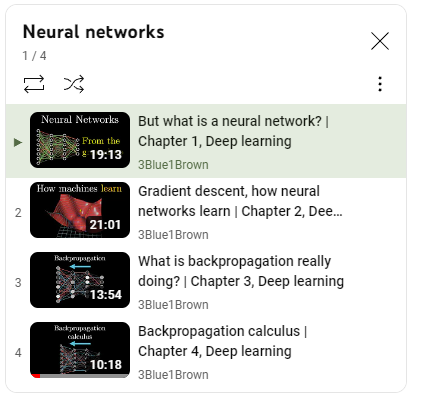

Recommended deep learning references

**Dive into deep learning**
- https://d2l.ai/chapter_multilayer-perceptrons/backprop.html

**3Blue1Brown Neural Networks series:** 

- What is backpropagation really doing? | Chapter 3, Deep learning: https://www.youtube.com/watch?v=Ilg3gGewQ5U 
- Backpropagation calculus | Chapter 4, Deep learning: https://www.youtube.com/watch?v=tIeHLnjs5U8

**Deepmind Deep Learning Lectures**
- DeepMind x UCL | Deep Learning Lectures | 2/12 | Neural Networks Foundations: https://www.youtube.com/watch?v=FBggC-XVF4M&list=PLqYmG7hTraZCDxZ44o4p3N5Anz3lLRVZF&index=2&ab_channel=DeepMind